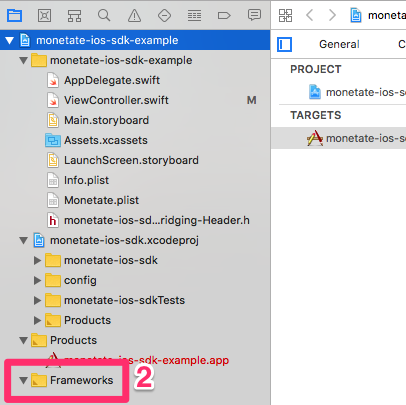
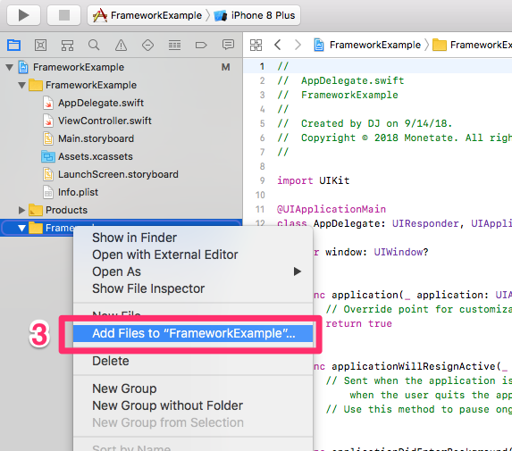
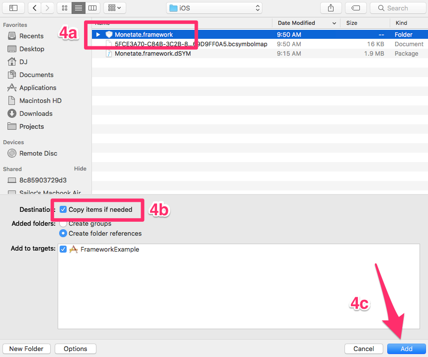
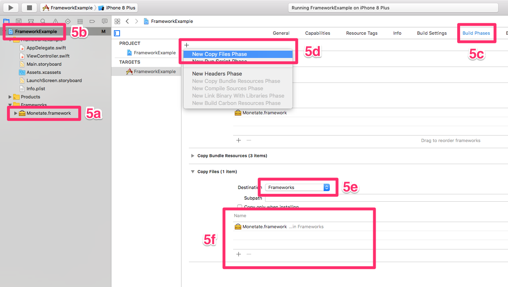
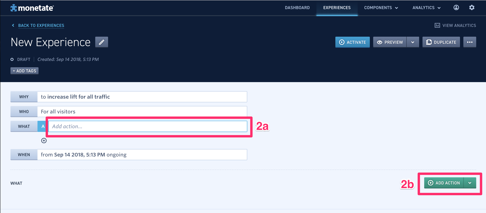
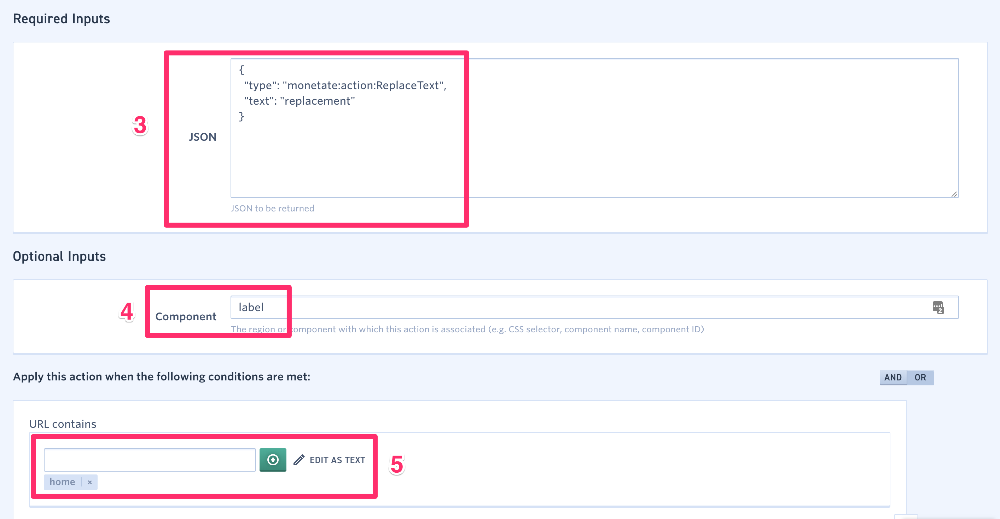
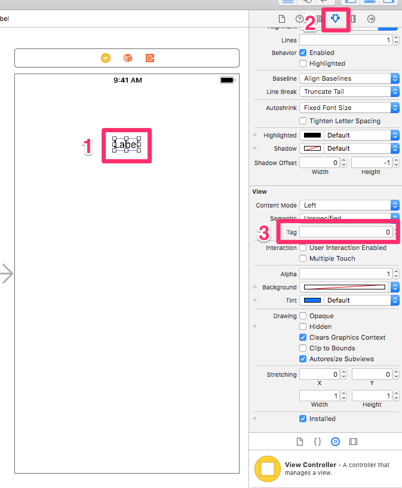

_The Monetate iOS SDK is a framework that wraps Monetate's Engine API_

# About
The Monete iOS SDK provides a convenient way to interact with the Engine API.  It enables compiling a list of events, sending that list of events to the API, and executing actions dictated by the API to update an app's user interface.  The SDK is written in Objective-C and has no other dependencies.

# Setting up the SDK

## Installation
The SDK can be installed via direct inclusion, Cocoapods, and Carthage.

### Direct Inclusion
The SDK can be added to a project without the use of any package managers.  To do so, first download the SDK's zipped framework file, `Monetate.framework.zip`, from the Monetate website (TODO - add link).  Unzip the file and make a note of its location.

1. Open your app in Xcode.
2. In the Navigator pane to the left, add a folder called _Frameworks_ at the root level.  This step can be skipped if your app already has a different location for including framework files.  For the sake of brevity, this guide will asume the suggested _Frameworks_ folder was created.



3. Right click on the _Frameworks_ folder and select _Add Files to "\<PROJECT_NAME\>"..._



4. In the file selector that appears, navigate to the folder containing the unzipped _Monetate.framework_ folder, and select it.  Make sure that _Copy items if needed_ is checked, and click _Add_.



5. Expanding the _Frameworks_ folder should now show the _Monetate.framework_ folder as part of the project.  To finish installing the framework, navigate to the _Build Phases_ tab of the project's settings.  Click the _+_ in the upper left and select _New Copy Files Phase_.  Expand the _Copy Files_ item that's added, and select _Frameworks_ as the destination.  Lastly, drag the _Monetate.framework_ folder from the Navigation pane to the file list.



At this point, the SDK should be fully available for your app to use.  To verify the installation, import the Monetate module into any view controller and attempt to call `Monetate.monetateQ()` in the controller's `viewDidLoad` method.  Running the app and navigating to the view controller should cause the text _Monetate: No Monetate.plist file found._ to be output in the console.

### Cocoapods
TODO - Update after the SDK is available via Cocoapods

At this point, the SDK should be fully available for your app to use.  To verify the installation, import the Monetate module into any view controller and attempt to call `Monetate.monetateQ()` in the controller's `viewDidLoad` method.  Running the app and navigating to the view controller should cause the text _Monetate: No Monetate.plist file found._ to be output in the console.

### Carthage
TODO - Update after the SDK is available via Carthage

At this point, the SDK should be fully available for your app to use.  To verify the installation, import the Monetate module into any view controller and attempt to call `Monetate.monetateQ()` in the controller's `viewDidLoad` method.  Running the app and navigating to the view controller should cause the text _Monetate: No Monetate.plist file found._ to be output in the console.

## The `Monetate.plist` file
The Monetate SDK requires an app to add a `Monetate.plist` configuration file.  The location of the file in the project's folder structure is left up the app using the SDK, but the file needs to be part of the project's `mainBundle`.

The plist file should contain the following keys/values:
- `RETAILER_SHORTNAME` _(String)_ - The retailer shortname used by the app.  If you don't know your retailer shortname, please contact a Monetate administrator.
- `CHANNEL` _(String)_ - A string that identifies the account, domain, and instance associated with the app.  If you don't know your channel, please contact a Monetate administrator.
- `COMPONENTS` _(Dictionary)_ - A collection of the components that will respond to actions sent by the Engine API.  Each item in the `COMPONENTS` dictionary should be of type _Number_, where the key is the name assigned to the component in the Engine API.  The value should be the tag id for the element in Interface Builder.  These values and their configurations are covered in greater detail in the section [Executing Engine API Actions](#executing-engine-api-actions).  Additionally, while the `COMPONENTS` key is required to be present it's acceptable to have no value objects.


Adding a `Monetate.plist` file with the above keys and their associated values (even with no entries for the `COMPONENTS` key) should cause the _Monetate: No Monetate.plist file found._ console warning to no longer appear.  Once that happens, the SDK is fully configured and ready to be used.

# Using the SDK
The main entry point into the SDK is the `Monetate.monetateQ()` method.  This operates similarly to the `monetateQ` object in web implementations, allowing an app to manage a list of events and send them to the Engine API.  You can also access the config values set in the `Monetate.plist` file via the `Monetate.monetateQ().config()` method.

## Managing events

### Creating events
To get started creating events, first import the Monetate module into the file using it:

**Swift**
```
import Monetate
```

**Objective-C**
```
@import Monetate;
```

Creating an event is as easy as instantiated the event's class:

**Swift**
```
let pageView = PageViewEvent(pageType: "example", path: "/example", url: nil)
```

**Objective-C**
```
PageViewEvent *pageView = [[PageViewEvent alloc] initWithPageType:@"example" path:@"/example" url:nil];
```

The following Engine API events are currently available:
- `CartEvent`
- `CoordinatesEvent`
- `CustomVariablesEvent`
- `DecisionRequestEvent`
- `IpAddressEvent`
- `MetadataEvent`
- `PageViewEvent`
- `ProductDetailViewEvent`
- `PurchaseEvent`
- `ReferrerEvent`
- `ScreenSizeEvent`
- `UserAgentEvent`

Additionally, there are several event models available for use by specific events:
- `CartLine` - Represents a single cart item in a `CartEvent`
- `CustomVariable` - Represents a single custom variable in a `CustomVariableEvent`
- `PurchaseLine` - Represents a single purchased item in a `PurchaseEvent`
- `Product` - Represents a single product that has been viewed in a `ProductDetailViewEvent`

Further documentation about these events can be found in their class docs (TODO - add link).

### Adding events to the queue
To add an event to the queue, use the `addEvents` method on `Monetate.monetateQ()`.  Using the above `pageView` variable:

**Swift**
```
Monetate.monetateQ().addEvent(pageView)
```

**Objective-C**
```
[[Monetate monetateQ] addEvent:pageView];
```

### Viewing the event queue
To see the current event queue, use the `events` method on `Monetate.monetateQ()`:

**Swift**
```
Monetate.monetateQ().events()
```

**Objective-C**
```
[[Monetate monetateQ] events];
```

### Modifying the event queue
Events can be removed from the queue using either a reference to the event, or the event's index number.

By reference:

**Swift**
```
let pageView = PageViewEvent(pageType: "example", path: "/example", url: nil)
Monetate.monetateQ().addEvent(pageView)
Monetate.monetateQ().removeEvent(pageView)
```

**Objective-C**
```
PageViewEvent *pageView = [[PageViewEvent alloc] initWithPageType:@"example" path:@"/example" url:nil];
[[Monetate monetateQ] addEvent:pageView];
[[Monetate monetateQ] removeEvent:pageView];
```

By index:

**Swift**
```
Monetate.monetateQ().addEvent(PageViewEvent(pageType: "example", path: "/example", url: nil))

var eventIndex = -1;

// Iterate through the list of events
for (index, event) in Monetate.monetateQ().events().enumerated() {

  // Check to see if the event is a PageViewEvent
  if ((event as! Event).isKind(of: PageViewEvent.self)) {

    // Save the PageViewEvent index
    eventIndex = index;
  }
}

if (eventIndex > -1) {
  Monetate.monetateQ().removeEventAt(index: Int32(eventIndex))
}
```

**Objective-C**
```
PageViewEvent *pageView = [[PageViewEvent alloc] initWithPageType:@"example" path:@"/example" url:nil];
[[Monetate monetateQ] addEvent:pageView];

int eventIndex = -1;

// Iterate through the list of events
[[[Monetate monetateQ] events] enumerateObjectsUsingBlock:^(Event event, NSUInteger index, BOOL *stop) {

  // Check to see if the event is a PageViewEvent
  if ([event isKindOfClass:PageViewEvent]) {

    // Save the PageViewEvent index
    eventIndex = index;
  }
}];

if (eventIndex > -1) {
  [[Monetate monetateQ] removeEventAtIndex:eventIndex];
}
```

An event can be directly replaced using the `setEvent` method.

**Swift**
```
Monetate.monetateQ().addEvent(PageViewEvent(pageType: "example", path: "/example", url: nil))

Monetate.monetateQ().setEvent(event: PageViewEvent(pageType: "example2", path: "/example2", url: nil), index: 0)
```

**Objective-C**
```
PageViewEvent *pageView = [[PageViewEvent alloc] initWithPageType:@"example" path:@"/example" url:nil];
[[Monetate monetateQ] addEvent:pageView];

PageViewEvent *pageView2 = [[PageViewEvent alloc] initWithPageType:@"example2" path:@"/example2" url:nil];

[[Monetate monetateQ] setEvent:pageView2 atIndex:0];
```

## Sending events to the Engine API
The event queue can be submitted to the Engine API using the `sendEvents` method on `Monetate.monetateQ()`.  This can be called either with or without a handler.  If a handler is supplied, it will be executed after the events have been successfully submitted to the API, and after any actions returned by the API have been executed.

**Swift**
```
// Without a handler
Monetate.monetateQ().sendEvents()

// With a handler
Monetate.monetateQ().sendEvents {
  // Do something here
}
```

**Objective-C**
```
// Without a handler
[[Monetate monetateQ] sendEvents];

// With a handler
[[Monetate monetateQ] sendEventsWithHandler:^(void) {
  // Do something here
}];
```

## Executing Engine API Actions
In addition to sending events to the Engine API, the SDK can execute actions that the API returns to update an app's user interface.  This is done by creating a mapping between an actionable UI element and an Omni JSON with Component Input action that has been configured in a Monetate Experience.  The following steps implement this configuration within the app and Monetate platform, and demonstrates how to trigger actions in the API response.

### Configuring actions in the Engine API
To allow a Monetate Experience to interact with the iOS SDK, it must be an _Omnichannel_ experience that uses an _Omni JSON with Component Input_ for it's "What" value.  Currently, the only available action is the `ReplaceTextAction`, which replaces the text of the target element with different text.  This action can be executed on any element that is a subclass of `UIView` that responds to the `setText:` selector.  This action is configured the following way:

1. In the Monetate dashboard, navigate to (or create) the _Omnichannel_ experience that you would like to configure.
2. In the dashboard for the above experience, click on the _What_ option, then click on the _Add Action_ button.



2. In the action type menu, select _Other > Omni JSON with Component Input_.  If _Omni JSON with Component Input_ is not available as an action type, verify that your experience is an _Omnichannel_ one, then contact your Monetate administrator.

3. Under the _Required Inputs_ section, add the following keys/values to the returned JSON object:
    - _type_ - The value should be _monetate:action:ReplaceText_
    - _text_ - The replacement text that will be swapped into the UI

4.  Under the _Optional Inputs_ section, for the _Component_ field, add the name of the UI element that you would like to be affected by the action, i.e. "login_button", "cart_label".  This name will be used again later.

5.  Lastly, configure the conditions under which your action should execute, then click _Save_.



### Adding tags in Interface Builder
In Xcode's Interface Builder, a _tag_ is a unique integer assigned to a single UI element that allows it to be referenced and retrieved programmatically.  Any element meant to respond to actions from the API is required to have a tag, and the SDK requires that an element's tag be unique within its view controller.

To add a tag to an element in Interface Builder, select the element and navigate to the _View_ section of the _Attributes Inspector_.



### Configuring the `Monetate.plist` file
The link between an element's component name and its Interface Builder tag is the `COMPONENTS` key in the `Monetate.plist` file.  For each element that will be actionable, add an entry for it under the `COMPONENTS` key in the `Monetate.plist` dictionary with a _Number_ type.  The key should be the name supplied for the _Component_ field when the action was created in the Monetate experience dashboard.  The value should be the Interface Builder tag assigned to the element.


### Creating a `DecisionRequestEvent`
Now that everything has been configured, executing actions is relatively simple.  If a _DecisionRequestEvent_ is included as one of the events sent to the Engine API, the API will return any relevant actions and the SDK will attempt to execute them. The _DecisionRequestEvent_ must have a reference to the `UIViewController` that it's target element resides in, which means that you cannot execute actions across multiple view controllers simultaneously.

A _DecisionRequestEvent_ can be created the following way from within a view controller:

**Swift**
```
DecisionRequestEvent(controller: self, filters: nil, requestId: "12345", includeReporting: false, manageImpressions: false)
```

**Objective-C**
```
DecisionRequestEvent *decisionRequest = [[DecisionRequestEvent alloc] initWithController:[[UIViewController alloc] init] filters:nil requestId:@"12345" includeReporting:true manageImpressions:false];
```